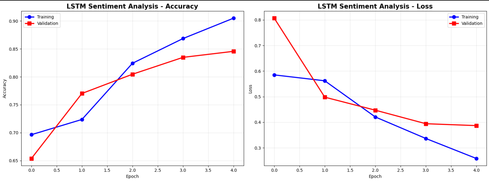
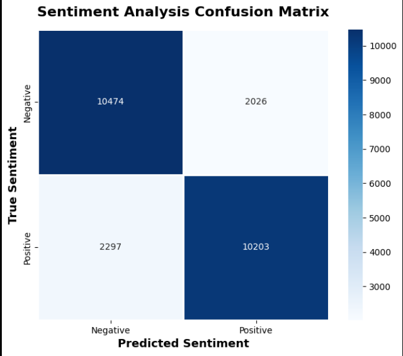

# IMDB Sentiment Analysis with LSTM

Deep learning sentiment classifier using Bidirectional LSTM for IMDB movie reviews, achieving 82.71% test accuracy.

## Performance

- **Test Accuracy**: 82.71%
- **Validation Accuracy**: 84.56%
- **Test Loss**: 0.4326
- **Correct Predictions**: ~20,678 out of 25,000 reviews

## Dataset

IMDB Movie Review Dataset:
- Training reviews: 25,000
- Test reviews: 25,000
- Total: 50,000 reviews
- Label distribution: 50% positive, 50% negative
- Vocabulary size: 10,000 most frequent words
- Sequence length: 200 words (padded/truncated)

## Model Architecture

Bidirectional LSTM with embedding layer:

```
Embedding Layer:       10,000 vocab → 128 dimensions
Bidirectional LSTM 1:  64 units (return sequences)
Bidirectional LSTM 2:  32 units
Dense Layer:           64 neurons (ReLU)
Dropout:               0.5
Output Layer:          1 neuron (Sigmoid)
```

### Architecture Details

**1. Embedding Layer**
- Input: 10,000 words
- Output: 128-dimensional vectors
- Purpose: Convert words to dense vectors

**2. Bidirectional LSTM (64 units)**
- Reads sequences forward and backward
- Returns sequences for next layer
- Captures context from both directions

**3. Bidirectional LSTM (32 units)**
- Final sequence processing
- Outputs single representation

**4. Dense & Dropout**
- Dense(64): Feature combination
- Dropout(0.5): Prevents overfitting
- Output(1): Sentiment probability (0-1)

## Training Details

- **Optimizer**: Adam
- **Loss Function**: Binary Crossentropy
- **Epochs**: 5
- **Batch Size**: 128
- **Validation Split**: 20%
- **Early Stopping**: Monitored validation accuracy
- **Hardware**: GPU (Google Colab T4)

### Training Progress

| Epoch | Train Accuracy | Val Accuracy |
|-------|----------------|--------------|
| 1 | 61.83% | 65.38% |
| 2 | 71.57% | 77.02% |
| 3 | 80.94% | 80.46% |
| 4 | 86.95% | 83.48% |
| 5 | 90.41% | 84.56% |

Best validation accuracy: 84.56% (Epoch 5)

## Visualizations



*Accuracy and loss curves during training*




*Binary classification performance (Positive/Negative)*


## Technologies

- Python 
- TensorFlow 
- Keras
- NumPy
- pandas
- matplotlib
- seaborn
- scikit-learn

## Installation

```bash
git clone https://github.com/varadshajith/imdb-sentiment-lstm.git
cd imdb-sentiment-lstm
pip install -r requirements.txt
```

## Usage

```python
from tensorflow import keras
from tensorflow.keras import layers
from tensorflow.keras.preprocessing.sequence import pad_sequences

# Load IMDB dataset
(x_train, y_train), (x_test, y_test) = keras.datasets.imdb.load_data(num_words=10000)

# Pad sequences
max_len = 200
x_train_padded = pad_sequences(x_train, maxlen=max_len, padding='post', truncating='post')

# Build model
model = keras.Sequential([
    layers.Embedding(input_dim=10000, output_dim=128, input_length=200),
    layers.Bidirectional(layers.LSTM(64, return_sequences=True)),
    layers.Bidirectional(layers.LSTM(32)),
    layers.Dense(64, activation='relu'),
    layers.Dropout(0.5),
    layers.Dense(1, activation='sigmoid')
])

# Compile and train
model.compile(optimizer='adam', 
              loss='binary_crossentropy', 
              metrics=['accuracy'])

model.fit(x_train_padded, y_train, 
          epochs=5, batch_size=128, 
          validation_split=0.2)

# Predict sentiment
prediction = model.predict(new_review)
# > 0.5 = Positive, < 0.5 = Negative
```

## Project Structure

```
imdb-sentiment-lstm/
├── sentiment_analysis.ipynb
├── README.md
└── requirements.txt
```

## Key Insights

**Why Bidirectional LSTM?**
- Captures context from both past and future words
- Better understanding of sentence structure
- Improved accuracy over unidirectional LSTM

**Performance Analysis**
- Training accuracy (90.41%) vs test accuracy (82.71%) shows some overfitting
- Dropout layer helps but more regularization could improve generalization
- 82.71% is solid performance for sentiment classification

**Architecture Advantages**
- Embedding reduces vocabulary to dense vectors
- Two LSTM layers capture complex patterns
- Bidirectional processing improves context understanding

## License

MIT License

## Contact

Varad Shajith
- GitHub: [@varadshajith](https://github.com/varadshajith)
- Email: varadshajith@gmail.com
